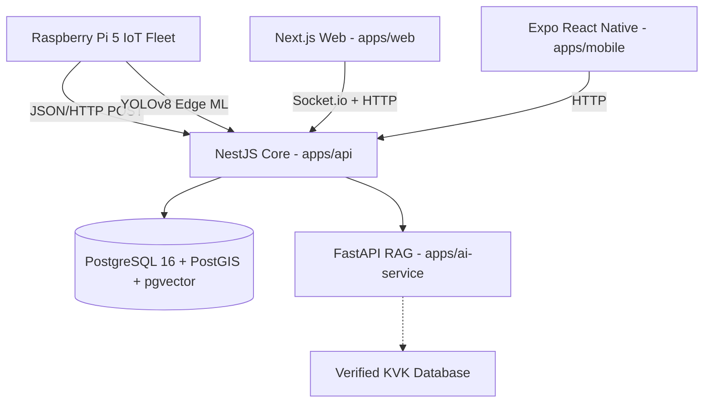

# Architecture

> Generated by /map on 2026-03-22

## Overview
KRISHi-EYE is a production-grade precision agriculture orchestration platform designed for continuous hardware telemetry ingestion, edge-driven Computer Vision (CV) diagnostics, and AI-grounded agronomic advisory. It uses a scalable Turborepo architecture containing discrete front-end Next.js and Expo clients communicating securely to a centralized PostGIS/pgvector NestJS backbone.

## System Diagram

## Components

### NestJS Backend (`apps/api`)
- **Purpose**: High-throughput telemetry validation, RBAC authentication (OTP), PostGIS geometry parsing, and real-time Socket.io dispatching.
- **Dependencies**: Prisma ORM, JSON Web Tokens.
- **Dependents**: WebApp, MobileApp, IoT Fleet.

### Next.js Web Dashboard (`apps/web`)
- **Purpose**: Farm operator control point for live fleet visualizations (Heatmaps, WKT Tractor mapping, GNSS Trust indicators) and advisory chat interfaces.
- **Dependencies**: React 19, TailwindCSS, shadcn/ui.
- **Dependents**: Farmer / Ops Managers.

### FastAPI AI Service (`apps/ai-service`)
- **Purpose**: Isolated Python service managing ICAR ground-truth Retrieval Augmented Generation (RAG) using `pgvector`.
- **Dependencies**: Uvicorn, SentenceTransformers.
- **Dependents**: NestJS Backbone.

### Core Schema Types (`packages/types`)
- **Purpose**: Single source of truth guaranteeing type collision safety across the entire monorepo boundaries (Frontend & Backend).

## Data Flow
1. **Telemetry**: Boustrophedon coordinates (`latitude`/`longitude`), `speedKmph`, and `sprayActive` events enter via `POST /v1/telemetry/batch`. The API casts coordinates into `POINT` PostGIS types, drops empty variables, and broadcasts a `LIVE_UPDATE` via WebSocket for the web client to render the live icon and heatmap tiles.
2. **AI RAG**: Users request agronomic support. The web client POSTs to NestJS. NestJS proxies the vector boundary query to `ai-service`, which fetches vector neighborhoods inside the shared database, appending government references before returning the fully cited response.

## Integration Points
| External Service | Type | Purpose |
|------------------|------|---------|
| Vercel | API Host | Frictionless Frontend Staging & Delivery |
| Render.io | API Host | Backend Docker Container CI/CD |
| LLM Provider | OpenAI / OSS | RAG Generation |

## Conventions
- **Naming**: `camelCase` for variables, `kebab-case` for URLs and directories.
- **Structure**: Strongly isolated `Turborepo` apps sharing discrete logic modules inside `packages/types`.
- **Testing**: Manual developer validation + TypeScript strict compilation + strict class-validator DTOs.

## Technical Debt
- [ ] Investigate connection reliability loops inside the Python Raspberry Pi 5 simulation `buffer.db`.
- [ ] Formalize RTK network limits when migrating from DGPS.
- [ ] Migrate `doctor.ps1` to cross-platform compatibility.
