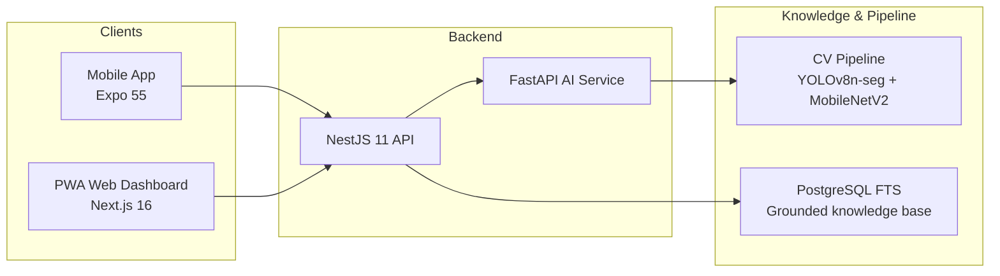
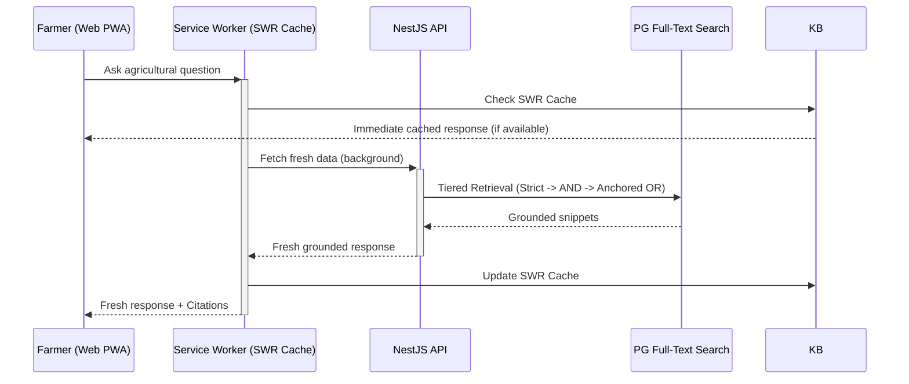

# 🏗️ System Architecture

## High-Level Flow

## Request Flow (AI Advisory)

## Security Architecture

| Layer | Implementation |
|-------|----------------|
| **Transport** | SSL/TLS enforced on Render and Vercel. |
| **Authentication** | JWT stored in **HttpOnly, Secure, SameSite=Strict** cookies. |
| **Response Safety** | `headersSent` guard in `AllExceptionsFilter` to prevent socket crashes. |
| **Headers** | `Helmet` integration for CSP, XSS protection, and HSTS. |
| **Data Access** | Parameterized Raw SQL via `Prisma.sql` to prevent SQL injection. |
| **PWA Security** | Network-only fallback for all Auth/POST requests in Service Worker. |

## RAG & Knowledge Engine

The Advisory system has been refactored from legacy Vector search to a robust, tiered **Full-Text Search (FTS)** strategy:
- **Tier 1 (Strict Websearch)**: Exact phrase matching.
- **Tier 2 (Standard AND)**: All keywords must be present.
- **Tier 3 (Anchored OR)**: Mandatory crop name + flexible descriptive terms.
- **Ranking**: `ts_rank` with positional relevance for high-precision results.
- **Data**: 50,000+ records from BhashaBench, SARTHI, and KCC datasets.

## PWA Capabilities

KRISHi-EYE is implemented as a full Phase 2 Progressive Web App:
- **Phase 1 (Basic)**: Offline fallback, home-screen installation, and static asset caching.
- **Phase 2 (Advanced)**: 
  - **SWR Caching**: Instantly serve previous Advisor results while updating in background.
  - **Push Notifications**: VAPID-based alerts for farm updates and new advisories.
  - **Cache Awareness**: UI badges indicating "Cached Result" with staleness timestamps.
