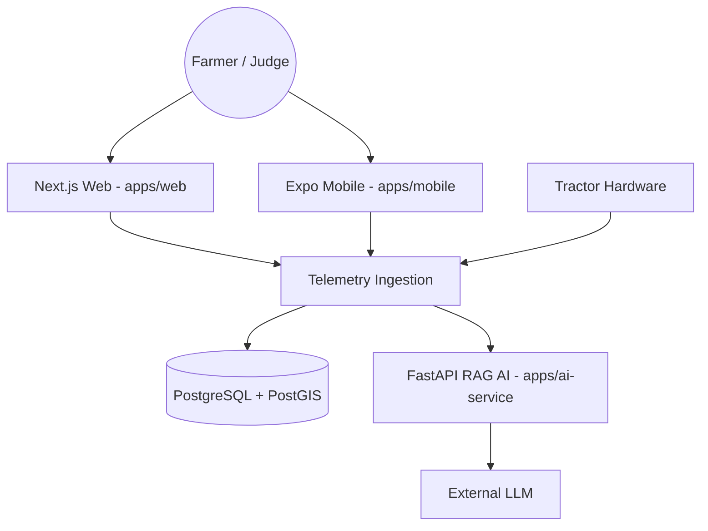

# KRISHI-EYE 🌾 | Precision Agriculture Platform

[](#)
[](#)
[](#)
[](LICENSE)

**KRISHI-EYE** is a production-grade precision agriculture platform designed for Indian farmers. It integrates real-time tractor telemetry, computer-vision disease detection, and LLM-powered agronomic advisory to transition farming from "blanket treatment" to "precision intervention."

---

## 🚀 Live Demo & Dashboard

> [!TIP]
> **Live Web Dashboard:** [krishi-eye.vercel.app](https://krishi-eye-webapp.vercel.app/)
> **API Docs:** [krishi-eye-api.onrender.com/api/docs](https://krishi-eye-api.onrender.com/api/docs)

> [!NOTE]
> The primary `.app` custom domain is currently undergoing DNS migration. Please use the verified Vercel/Render links above for immediate evaluation.

---

## 🏗️ System Architecture

KRISHI-EYE utilizes a modern monorepo architecture for seamless synchronization across mobile, web, and AI services.



---

## 🚜 Core Capabilities

### 1. Live Fleet Telemetry
- **Real-time Tracking**: Monitor tractor movement with sub-second latency via Socket.io.
- **Boustrophedon Generation**: Intelligent simulator generates realistic lane-by-lane patterns for demo environments.
- **Heatmap Visualization**: Dynamic infection heatmaps that update in real-time based on CV detections.

### 2. RAG Agronomic Advisory
- **Grounded Advice**: AI recommendations are grounded in verified ICAR/KVK knowledge bases using Retrieval-Augmented Generation (RAG).
- **Primary Source Citations**: Every piece of advice includes direct links to supporting research or government circulars.
- **Trust UI**: A dedicated interface to verify the LLM's sources and reasoning.

### 3. Edge Computer Vision
- **Multi-Stage Pipeline**: YOLOv8n Leaf Segmentation → MobileNetV2 Classification → U-Net Lesion Mapping.
- **Targeted Spraying**: Detection data drives a 6-lane boom-sprayer control system for optimal chemical use.

---

## 🛠️ Tech Stack

### Frontend & Mobile
- **Web**: Next.js 16 (App Router), React 19, Tailwind CSS, shadcn/ui.
- **Mobile**: Expo 55, React Native, React Navigation.

### Backend & AI
- **API**: NestJS 11, Prisma ORM, PostgreSQL (PostGIS + pgvector).
- **AI Service**: FastAPI, ONNX Runtime, OpenCV, PyTorch.

---

## 🏃 Quick Start

### 1. Clone & Install
```bash
git clone https://github.com/soham25-git/KRISHI-EYE_Webapp-India-Innovates_Open-Innovation.git
cd KRISHI-EYE_Webapp-India-Innovates_Open-Innovation
npm install
```

### 2. Environment Setup
Copy `.env.example` to `.env` in `apps/api` and `apps/web`.

### 3. Start Development
```bash
# Run everything simultaneously
npm run dev
```

---

## 📄 Documentation
- [Architecture Details](ARCHITECTURE.md)
- [Deployment Guide](docs/DEPLOYMENT.md)
- [API Reference](apps/api/README.md)

---

## 🛡️ Security
KRISHI-EYE implements production-grade security including:
- **HttpOnly Cookies**: JWTs are stored in secure, HttpOnly, SameSite cookies to mitigate XSS risks.
- **OTP Auth**: Passwordless authentication for rural accessibility.
- **Rate Limiting**: Throttling on all auth and telemetry ingestion endpoints.

---

MIT © [Soham Rangnekar](https://github.com/soham25-git)
